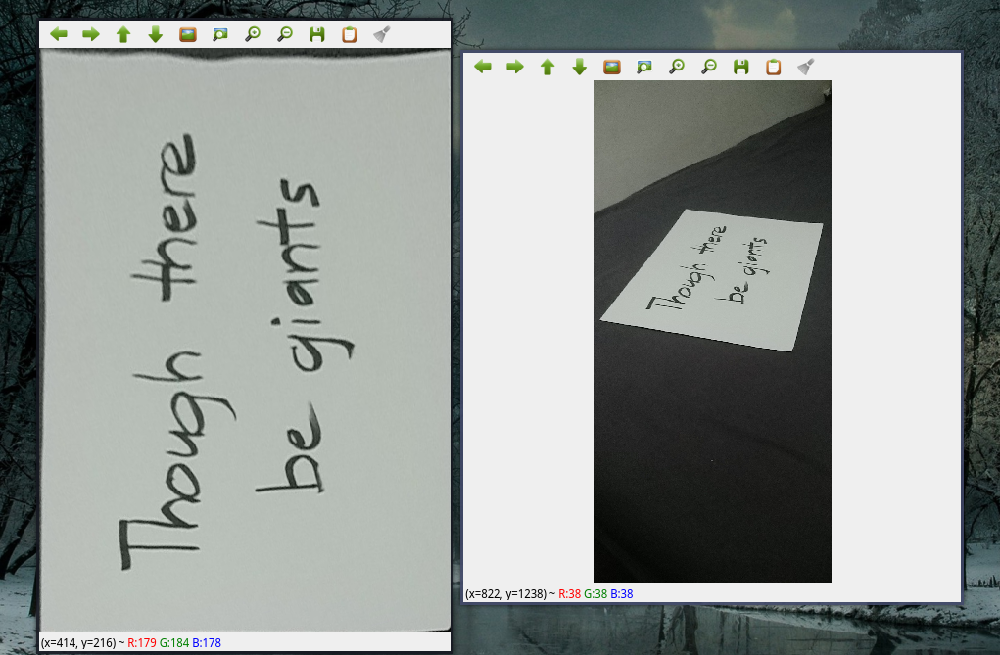

# Document Scanner in C++
This project was made to learn more about openCV and C++. 

## Dependencies
- cmake (3.1+)
- opencv (4.6)

## Usage
### Build the application
Using the build script
```bash
./build
```
Using cmake 
```
cmake -S . -B out/build/
cmake --build out/build/
```
### Run the application

```bash
./out/build/main
```
#### Output



